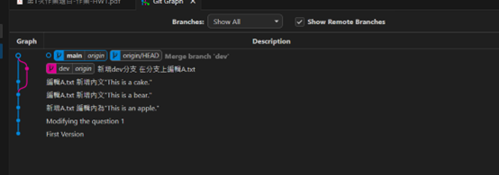
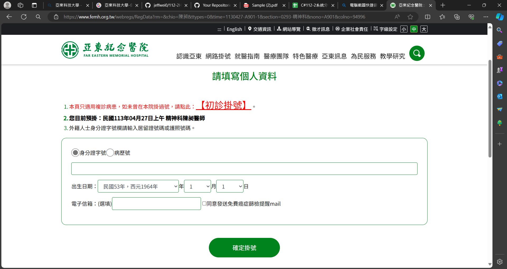
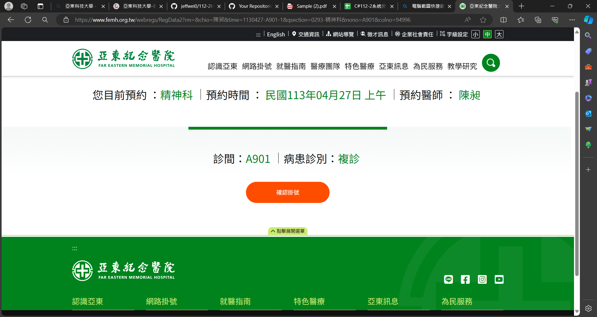
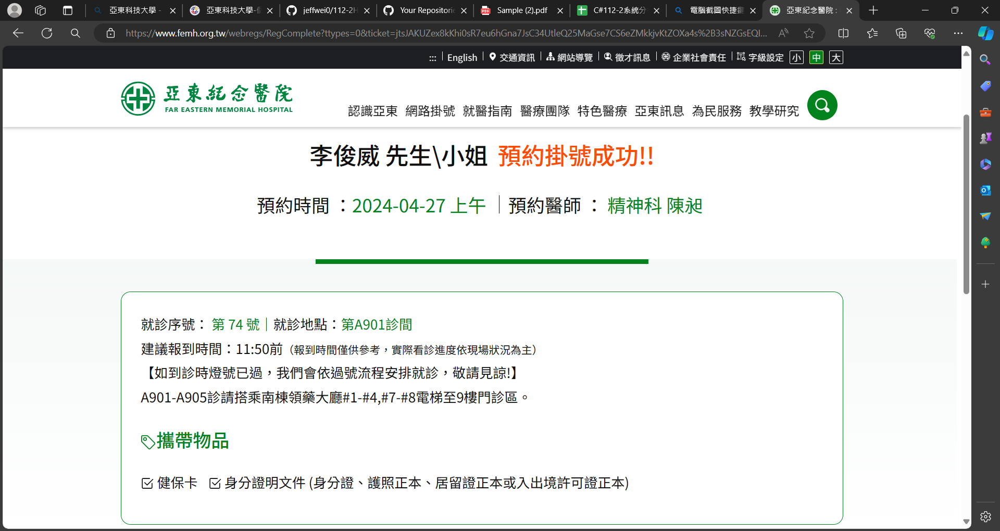

# 第1次作業-作業-HW1
>
>學號：111111211
> 
>姓名：李俊威
> 
>作業撰寫時間：40
> 
>最後撰寫文件日期：2024/04/21
>

本份文件包含以下主題：(至少需下面兩項，若是有多者可以自行新增)
- [x] 說明內容
- [x] 個人認為完成作業須具備觀念

## 說明程式與內容
第一小題建立分支與合併的結果

第二小題 亞東紀念醫院網路掛號流程如下

(1)點選我要掛號

(2)選擇需要掛號的科別

(3)選擇是否為第一次掛號 再選擇所需的時間

(4)填寫基本資料並按確定掛號

(5)確認掛號時間及科別後按確認掛號

(6)及玩完成亞東紀念醫院網路預約掛號
## 個人認為完成作業須具備觀念

需掌握指令：git branch 新的分支名稱(建立分支)、git checkout 分支名稱(切換)、git merge 某分支(合併)，等用法方可完成此次作業的撰寫